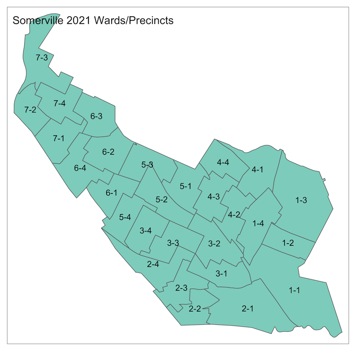
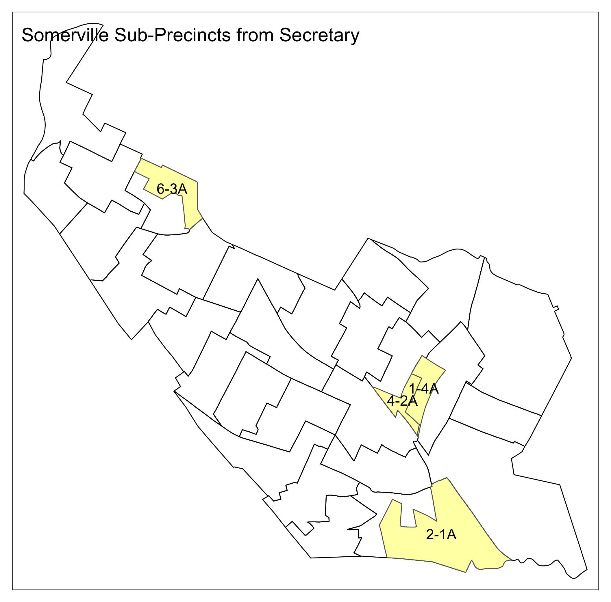
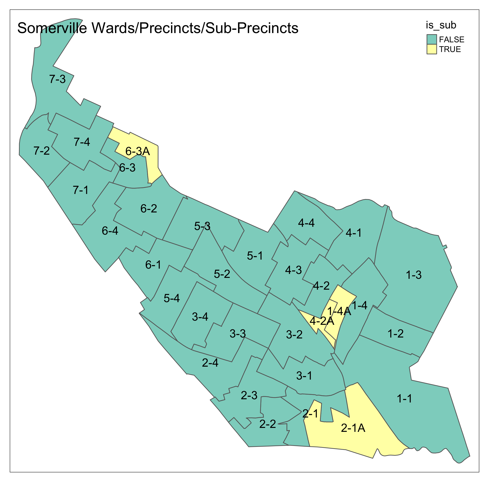
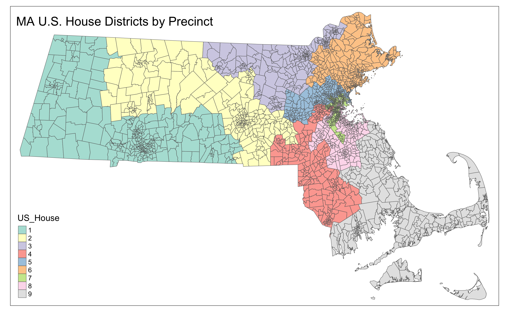
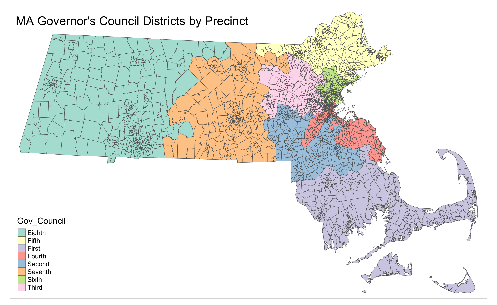
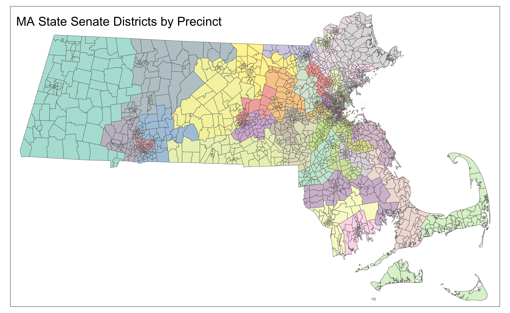
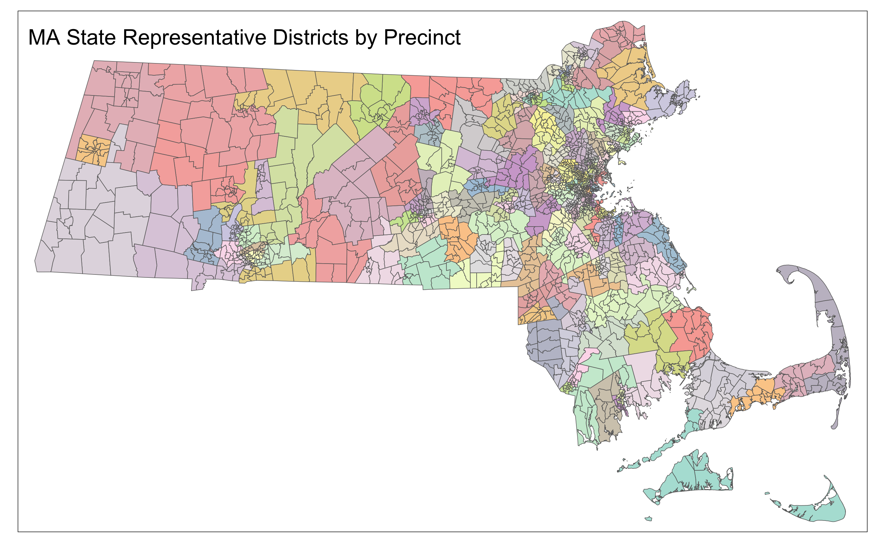

# ma-wards-precincts

A GIS description of 2021 versions of Massachusetts elections wards,
precincts, and sub-precincts, a mapping of U.S. House, Governor's
Council, State Senate, and State Representative districts to those
precincts, and results from the November 8, 2022 general election
at the same precinct level.

## Precinct Geometry

- GeoJSON - `ma_wards_precincts_w_subs.geojson`
- Shapefile - `ma_wards_pcts/ma_wards_precincts_w_subs.shp`

## Source Data

- Wards and Precincts (voting districts) [from MassGIS](https://www.mass.gov/info-details/massgis-data-2022-wards-and-precincts)
- Subprecincts from Secrectory of the Commonwealth (`sub_pct_shp`)
- Precinct-level election returns from [electionstats](https://electionstats.state.ma.us/)

## Generation Algorithm

I identified the sub-precincts that occurred in the 2022-11-08 vote
totals that also had a matching sub-precinct in the Shapefile from the
Secretary. I then subtracted the geometry of the sub-precincts from
the original parent precincts and then took the set of smaller parent
precincts, the unaffected precincts, and the vote-containing
sub-precincts.

The precinct-level election results from `electionstats` gave the
mapping from districts (U.S. House, Governor's Council, State Senate,
and State Representative) to wards, precincts, and sub-precincts. This
information is included in the file `ma_districts_precincts_2022.csv`
and also the GeoJSON and Shapefile attributes.

## Example Maps

